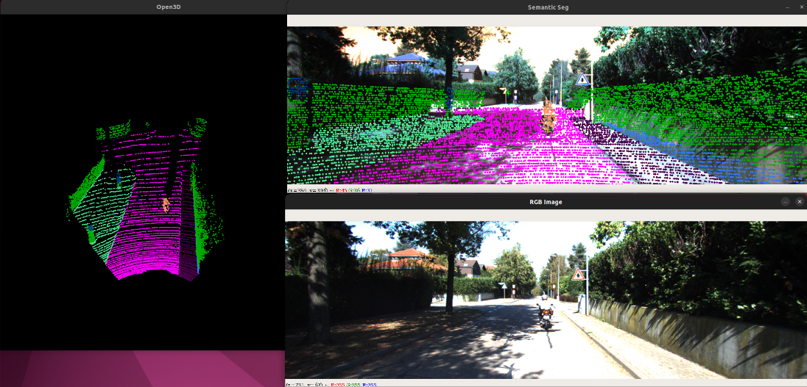
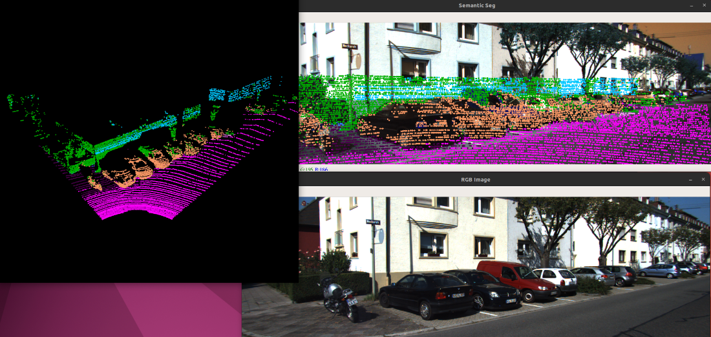

## Point Cloud Segmentation using PointNet 

This repo contains the implementation of the [PointNet](https://stanford.edu/~rqi/pointnet/) model for Semantic Segmentation of LiDAR scans on the [KITTI](http://www.semantic-kitti.org/dataset.html) dataset. 

## Contents
- [Requirements](#requirements)
- [Demo](#demo)
- [Dataset](#dataset)

## Requirements
```bash
pip install opencv-python numpy pandas torch torchvision h5py redis matplotlib pyyaml open3d tqdm 
```

## Demo
- Set the path of the environment variable ```KITTI_ROOT``` to the path of your dataset
```bash
python viewpoints.py
```




## Dataset
- Dataset used for this project is the [KITTI](http://www.semantic-kitti.org/dataset.html) Dataset with KITTI Odometry Benchmark Velodyne Point Clouds, Calibration data, Color RGB Dataset and SemanticKITTI label data. 
- Ensure the file structure is similar to this:
```bash
.
└── Dataset/
    └── Sequences/
        ├── 00/
        │   ├── Velodyne/
        │   │   ├── 000000.bin
        │   │   └── .
        │   ├── labels/
        │   │   ├── 000000.label
        │   │   └── .
        │   ├── image_2/
        │   │   ├── 000000.png
        │   │   └── .
        │   ├── image_3 /
        │   │   └── 000000.png
        │   ├── calib.txt
        │   ├── poses.txt
        │   └── time.txt
        ├── 01
        ├── .
        ├── .
        ├── .
        └── 21
```
